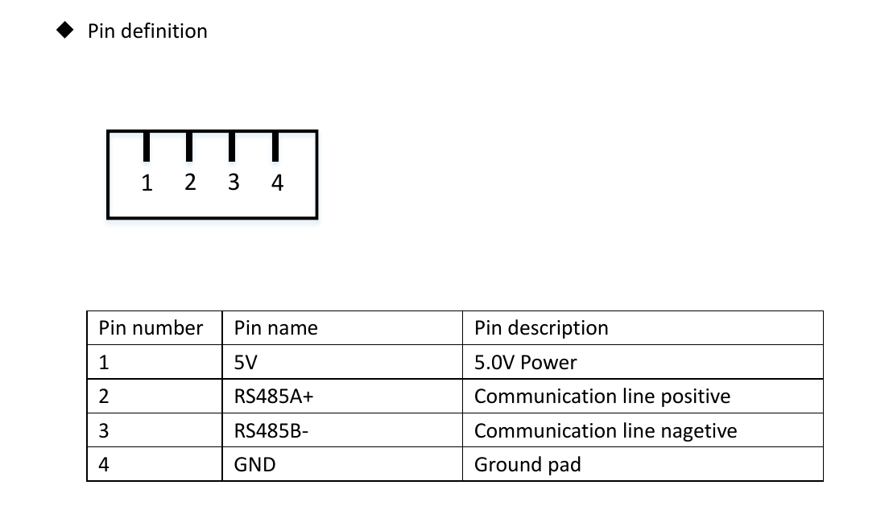
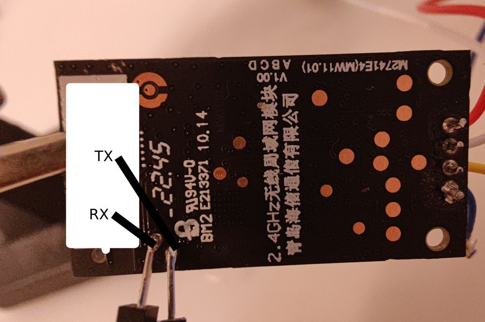

# AEH-W4G2 flashing

The AEH-W4G2 module uses the RTL8710BL chip, which is compatible with ESPHome.
Restoring of factory software wasn't tested.

## Required Items:
- 3.3V TTL adapter: Not all adapters may be compatible. For more information, visit the [LibreTiny project website](https://docs.libretiny.eu/docs/platform/realtek-ambz/#flashing).
- 5V power supply: I used the power supply from my TTL adapter, but this might not work depending on your USB or adapter.
- Soldering iron (optional): Keeping all the wires connected during flashing without a soldering iron can be difficult.

## Steps:

1. **Disconnect AEH-W4G2 from the AC unit:**
   - This might be tricky. In my case, it was impossible to disconnect the connectors from the module. As a result, I cut the cables with the power off.

2. **Connect power to the connector according to this diagram:**
   - 
   - GND is on the left side when you look at the board from the shielding side and the connection is rotated to the top. On my device, it is the blue wire. To be sure, you can check that GND is connected to the shield.

3. **Verify power:**
   - The device has no indication of whether it is working. You may check your Access Point logs to ensure that power is OK.

4. **Connect TX and RX:**
   - Connect TX and RX from the TTL adapter to RX and TX of AEH-W4G2.
   - 

5. **Connect to W4G2 using a serial console:**
   - If everything is connected well, you should see output like:
   ```
   uart_process_cmd no response

   uart status err,now status 1 drip data:

   uart_rx_end

   DevTypeCMD: f4 f5 00 40 0b 00 00 00 00 fe 01 00 00 0a 04 00

   DevTypeCMD: 01 58 f4 fb 

   uart_rx_start

   cmdwrite

   DEVWRITE: f4 f5 00 40 0b 00 00 00 00 fe 01 00 00 0a 04 00

   DEVWRITE: 01 58 f4 fb 
   ```
   - Consider connecting the module to the AC and saving logs after executing all possible commands from the original application. The implementation from this project may not yet support all features/devices, and the communication dumps are very helpful in adding them.

6. **Switch the chip to download mode:**
   - I wasn't able to find the CEN pin, but there is another way to enter download mode. Disconnect power, connect TX to GND, and reconnect power. Without disabling power, reconnect TX to the UART adapter.

7. **Dump the original software:**
   - Use [this guide/tool](https://docs.libretiny.eu/docs/flashing/tools/ltchiptool/#dumping-firmware). I haven't tested whether restoring the software afterwards is possible.

8. **Build UF2 with ESPHome:**
   - I used the board `generic-rtl8710bn-2mb-468k`, but I'm not sure it's the best model.

9. **Flash ESPHome:**
   - Follow [this guide/tool](https://docs.libretiny.eu/docs/flashing/tools/ltchiptool/#flashing-firmware).
